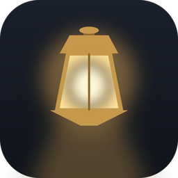
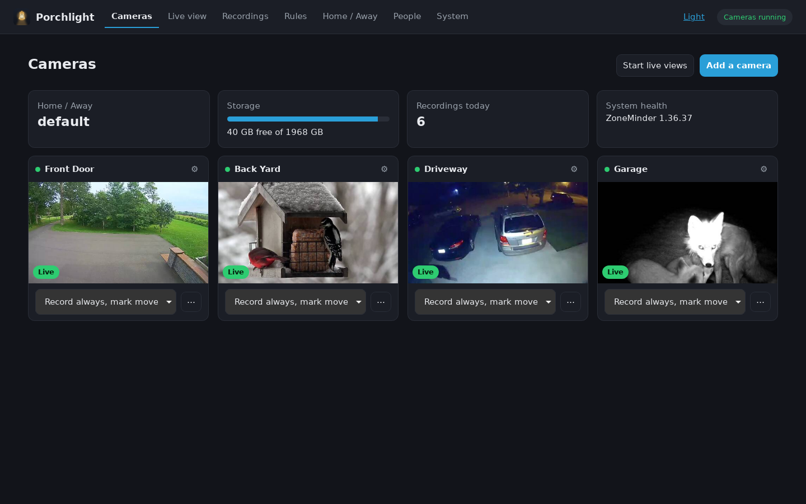
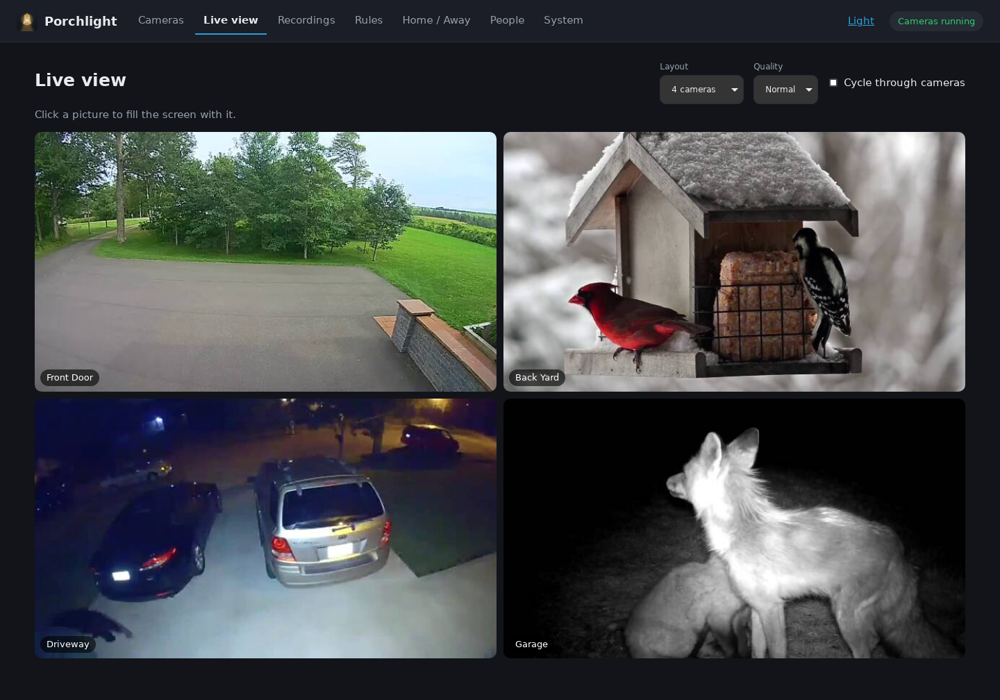
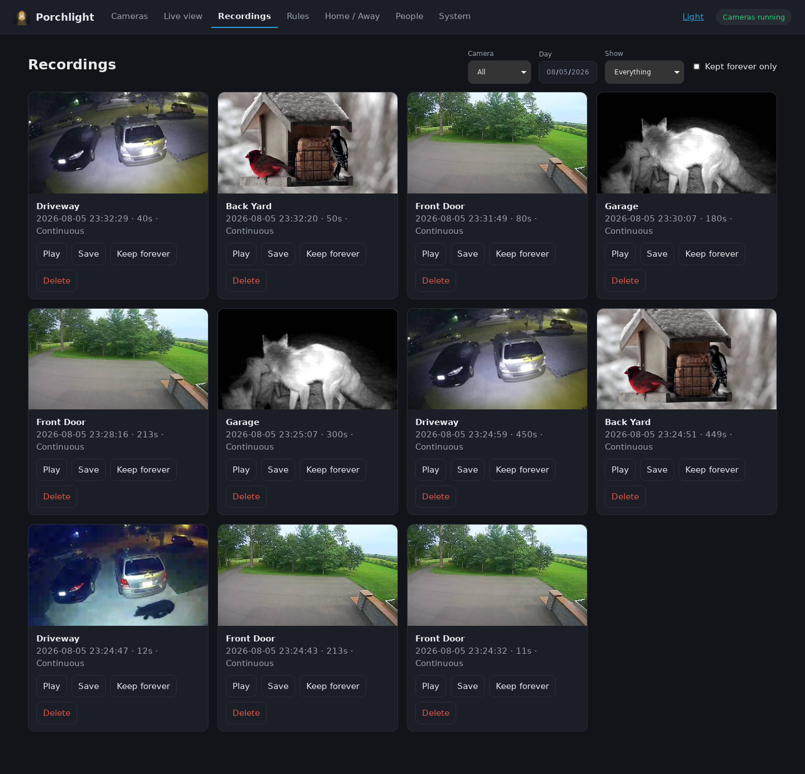
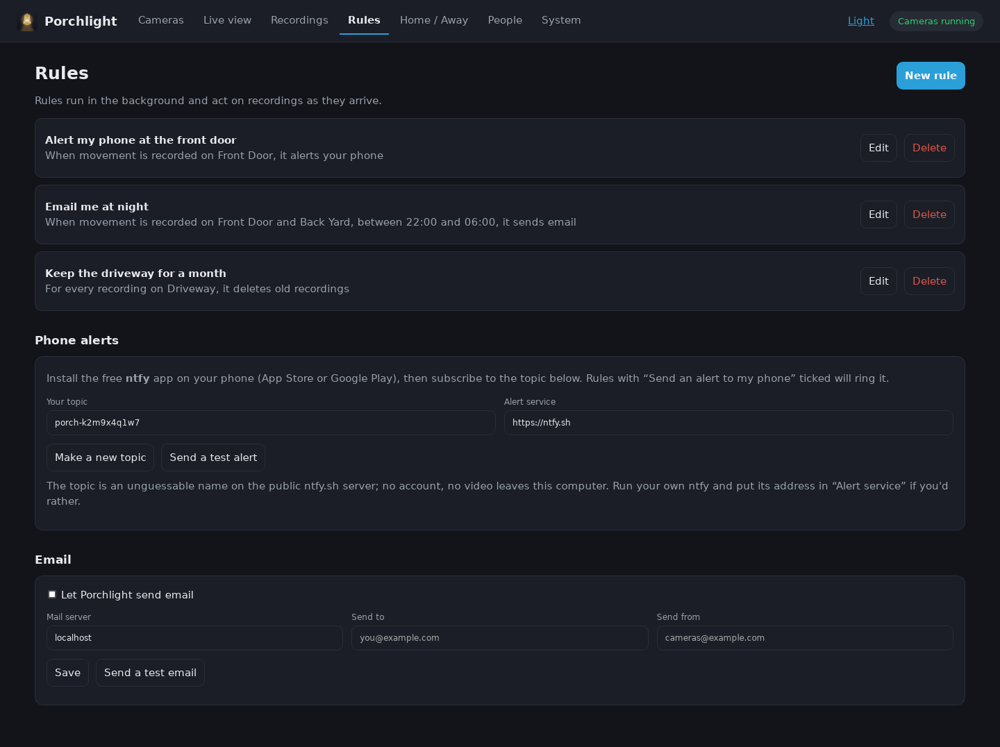
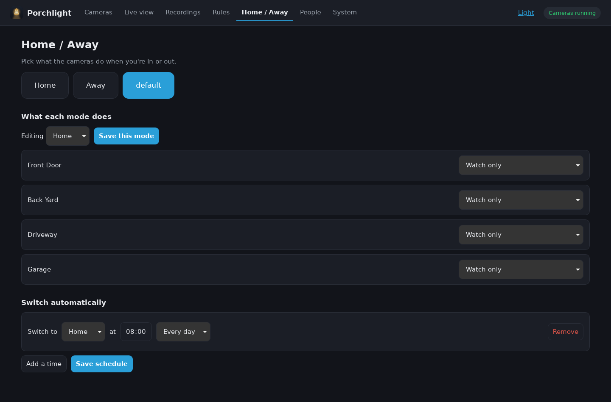
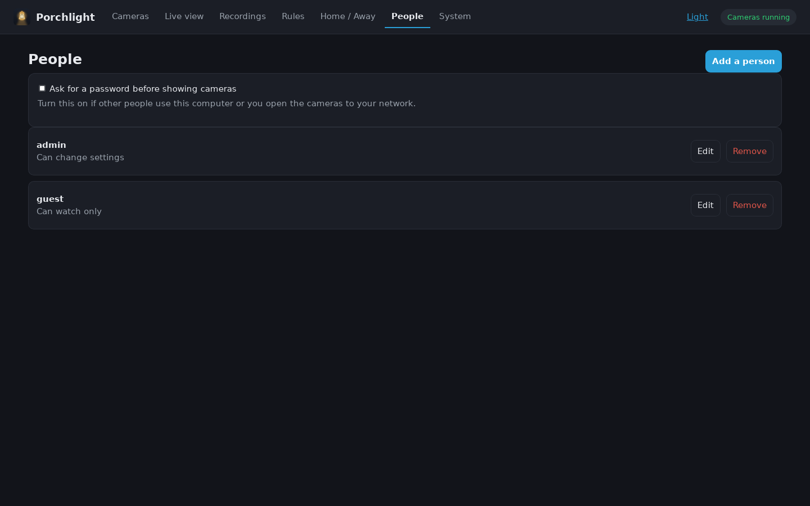
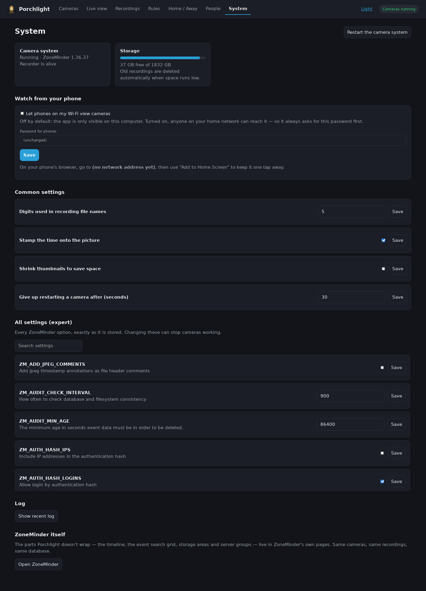

<p align="center">
  
</p>

<h1 align="center">Porchlight</h1>

<p align="center"><strong>Security cameras for people who don't want to learn security cameras.</strong></p>

<p align="center">
  A Debian package that installs and configures <a href="https://zoneminder.com">ZoneMinder</a>
  for you, then puts a plain-language web app in front of it.
</p>

<p align="center">
  
  
  
</p>



## Why Porchlight

- **Private by design.** Video is recorded, stored and watched on your own computer.
  No account, no cloud, no subscription — nothing leaves your house unless you send it.
- **Works with cameras you already own.** Porchlight scans your network with ONVIF and
  fills in the technical details itself. RTSP addresses, USB webcams, MJPEG cameras and
  plain video files all work too.
- **Phone alerts without a vendor app.** Movement rules ring your phone through the
  free, open-source [ntfy](https://ntfy.sh) app: an unguessable topic name, no account,
  and no video in the notification. Point it at your own ntfy server if you'd rather.
- **Watch from your phone.** Open the app to your home Wi-Fi — off by default, always
  password-protected — and save it to your phone's home screen like an installed app.
- **Plain language, expert power.** Everyday tasks read like sentences; every ZoneMinder
  option stays one click away in a searchable expert table.
- **Try it before the camera arrives.** A bundled sample video sets up a working camera
  so you can explore the whole app with nothing to plug in.

## A tour

### Cameras

Add a camera and Porchlight scans the network with ONVIF, asks for the camera's
username and password, works out the video address, and saves it. USB webcams, video
files, MJPEG cameras and hand-typed RTSP addresses are all under "More camera types".

Every camera gets a card: a still that refreshes about once a minute, a badge saying
whether it is live, off or unreachable, its recording mode, and a ⋯ menu for watching,
watched areas, moving and removing it. Above them sit four tiles — Home / Away,
storage, today's recordings and system health — that each open the page behind them.
The whole app is dark by default; "Light" in the top bar switches it and remembers
your choice. That's the page pictured at the top of this file.

### Live view

One, four, nine or sixteen cameras at once, at a quality you pick, optionally cycling
through them. Click a picture to fill the screen with it.



### Recordings

Filter by camera, day, motion or continuous, and kept-forever. Click to play, save the
clip, or keep it forever.



### Rules and phone alerts

"When movement is recorded on the Front Door between 22:00 and 06:00, alert my phone" —
written as a sentence, stored as a real ZoneMinder filter.

**Phone alerts** need no account and no cloud video: install the free
[ntfy](https://ntfy.sh) app, subscribe to the random topic on this page, and matching
recordings ring your phone. Email settings and a test button live on the same page.



### Home / Away

Each mode says what every camera does; switch by hand or on a weekly schedule.



### People

Turn on a password for the whole system and add viewer or manager accounts.



### System

Health, storage, restart, the common settings in plain English, and every ZoneMinder
option in a searchable expert table.

**Watch from your phone** opens the app to your home network. It is off by default;
turning it on requires a password, and every request that does not come from this
computer has to sign in with it. The page shows the address to type on your phone,
which can then be saved to the home screen as an app.



Per-camera **Settings** covers basics, connection, video, motion, PTZ control and, on
the last tab, every remaining ZoneMinder monitor field. **Areas** is a polygon editor
over a live snapshot for motion zones and privacy masks.

## Getting started

Porchlight runs on Debian and Ubuntu.

```sh
sudo apt install ./porchlight_2.0_all.deb
porchlight
```

The package pulls in ZoneMinder and MySQL, sets up the database, fixes the Ubuntu
packaging gaps that otherwise leave ZoneMinder broken, and adds a "Porchlight"
launcher. Running `porchlight` starts the local service on 127.0.0.1:8321 and opens it
in your browser. No camera yet? Click **Try it with a sample video** on the first
screen.

## Under the hood

- `server/zmapi.py` — everything that talks to ZoneMinder: REST API, token auth, ONVIF
  probing, and the request builders.
- `server/porchlight_server.py` — stdlib HTTP server, static files plus a JSON API.
- `web/` — vanilla HTML, CSS and JavaScript. No build step, no dependencies.
- `admin/porchlight-admin` — the only privileged code, reached through polkit with a
  fixed list of subcommands.
- `push.sh` — three lines of curl behind the phone alerts; ZoneMinder filters run it
  per event, with the topic in the command itself.

Filters and users are written straight to ZoneMinder's own database: the 1.36 API has
no filters endpoint and refuses user writes. The timeline, event search grid, storage
areas and server groups stay in ZoneMinder's own pages — same cameras, same
recordings, same database, linked from the System page.

### Development

```sh
./build.sh                 # builds porchlight_2.0_all.deb
python3 test_api.py        # pure-logic checks, prints "ok"
python3 e2e_drive.py       # full end-to-end run, needs a working ZoneMinder
python3 shots.py OUTDIR    # demo data + the screenshots above (needs Xvfb)
python3 tools/make_icon.py porchlight.png logo48.png   # redraws the app icon
```

The camera footage in the screenshots is public-domain video from Wikimedia
Commons: a home security camera on Prince Edward Island, a snowy bird feeder,
a suburban driveway at night, and a US Fish & Wildlife trail camera.
